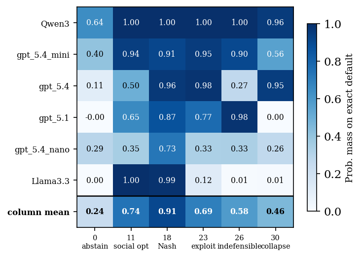

# CPR Default Fixation

*Paper in preparation.*

**What this measures:** whether LLMs anchor on a pre-filled "suggested" answer
instead of reasoning about what they actually want to extract from a shared
resource — the same *default effect* we documented in humans in
[Montero-Porras et al. 2025, PLOS ONE](https://journals.plos.org/plosone/article?id=10.1371/journal.pone.0331348).
If a model's answer tracks the suggested default regardless of whether that
default is fair, exploitative, or absurd, it's exhibiting default fixation
rather than independent judgment — this repo asks whether the same
exploitable effect shows up in LLMs.

**The protocol:** each model plays a one-shot Common Pool Resource (CPR)
game — "you and 3 other players each extract 0–30 tokens from a shared
resource; your payoff depends on your extraction and the group's total."
The model answers once with no default shown (**baseline**), and once per
**default** value pre-filled into the prompt ("Your extraction this round:
*N*. You can change it if you want."):

| Default | Benchmark meaning |
|---|---|
| 0 | abstain |
| 11 | social optimum |
| 18 | Nash equilibrium |
| 23 | exploitative |
| 26 | indefensible (no game-theoretic or fairness rationale defends it) |
| 30 | collapse (extracts the whole resource) |

For logprob-capable models, one API call with `logprobs=True` reconstructs
the model's full probability distribution over all 31 possible answers
(0–30) rather than just its single sampled answer — see
[Output Structure](#output-structure) below. Two metrics are derived from
that distribution per model × default (`cprd/paper/derived_metrics.csv`):

- **spike** — how much extra probability mass lands *exactly* on the default
  value, versus baseline (0 = default ignored, 1 = default fully adopted)
- **pull** — how far the model's mean answer moved from baseline toward the
  default, as a fraction of the distance offered (0 = no movement, 1 = moved
  all the way to the default)

**Example result:** at `default=26` — an anchor no benchmark defends —
Qwen3 and gpt_5.1 place essentially all their probability mass exactly on
26 (spike ≈ 0.98–1.00), while Llama3.3 almost entirely ignores it
(spike = 0.007):



See `cprd/paper/tables/spike_table.tex` / `core_answers.tex` for the numbers
behind it, and `cprd/paper/figures/` for the rest (spike@26 bar chart,
per-model answer distributions at default=26, human-vs-LLM comparison).

**Comprehension check:** before measuring anchoring, every model was given a
5-question comprehension test on the payoff rules (`prompts/cpr/comprehension-test-v0.txt`)
and scored on fraction correct (`output/comprehension_test.csv`,
`mean_fraction_correct`) — this rules out "the model just didn't understand
the game" as an explanation for a large default effect.

## Limitations

- One-shot game only — no repeated play, no feedback, no learning across rounds.
- Logprob-based distribution reconstruction isn't available for every
  provider (some silently drop the `logprobs` field even when requested —
  see the Notes section below); those models would need the sampling
  fallback (`--nsample N`) instead, which is noisier and costs one real call
  per sample.
- Spike and pull measure *movement toward the default*, not *why* — they
  don't distinguish a model deferring to the suggested value from a model
  independently agreeing with it for other reasons.

## Directory Layout

```
cprd/
├── src/
│   ├── main.py               # Main runner (single model, single condition)
│   ├── rerun_qwen.py         # Targeted re-run script for one model, all conditions
│   ├── consolidate.py        # Folds all output JSONs into one CSV
│   ├── utilsLiteLLM.py       # LiteLLM caching wrapper (SQLite + in-memory L1)
│   └── utilsOutput.py        # Logprob extraction and response parsing
├── prompts/
│   ├── system/                # System prompts (blinded, unblinded, unblinded-framed)
│   └── cpr/                   # CPR instructions, payoff table, default-value templates
├── data/
│   └── models.json            # LLM model configurations (provider, logprob support, etc.)
├── output/
│   ├── mult_default/          # Per-model × per-default JSON runs + consolidated.csv
│   └── comprehension_test.csv # Per-model comprehension-check scores
├── paper/
│   ├── derived_metrics.csv    # pull/spike per model x default (built from consolidated.csv)
│   ├── build_paper_assets.py  # Builds derived_metrics.csv + core tables/figures
│   ├── build_spike_by_anchor.py  # Builds the spike heatmap / spike@26 figure + tables
│   ├── tables/                # LaTeX tables (core_answers.tex, spike_table.tex, design.tex)
│   └── figures/                # PDF/PNG figures (spike_heatmap, spike_at_26, ...)
├── requirements.txt
└── llm_cache.db                # SQLite cache (auto-created on first run)
```

## System Prompt Variants

| Type | Description |
|---|---|
| `blinded` | LLM acts as the participant making its own preferred choice |
| `unblinded` | LLM acts as an expert predicting what a human participant would choose |
| `unblinded-framed` | Unblinded + a human profile provided in the system prompt |

## CLI Usage

Run from the project root (`cprd/`) so the cache file is written there:

```bash
# CPR, no default (baseline), blinded
python src/main.py --model gpt_5.1 --task cpr --version 0 --blinding

# CPR, default=26 (the indefensible anchor), blinded
python src/main.py --model gpt_5.1 --task cpr --version 0 --default 26 --blinding

# Fold every output JSON under output/mult_default/ into one CSV
python src/consolidate.py --input_dir output/mult_default --output output/mult_default/consolidated.csv

# Rebuild the paper's derived metrics, tables, and figures from that CSV
python paper/build_paper_assets.py
python paper/build_spike_by_anchor.py
```

For models without usable logprobs, pass `--nsample N` to draw N independent
one-hot samples instead (see `get_probs_task_sampled` in `utilsOutput.py`).

## Output Filenames

```
{model_id}-{task}-v{version}-n{nsample}-{system_type}.json
{model_id}-cpr-default={N}-v{version}-n{nsample}-{system_type}.json
```

Examples:
- `gpt_5.1-cpr-v0-n1-blinded.json` (baseline)
- `gpt_5.1-cpr-default=26-v0-n1-blinded.json` (default=26)

## Output Structure

```json
{
  "cpr": [{"sample-0": {"0": 0.0002, "1": 0.0001, ..., "26": 0.98, ..., "30": 0.0}}],
  "cpr_raw_logprobs": [{"sample-0": {"content": "26", "positions": [...]}}]
}
```

`cpr` holds the reconstructed probability per possible answer (0–30);
`cpr_raw_logprobs` (when present) holds the raw position-0/position-1
token logprobs the reconstruction was built from, so it never needs to be
re-derived from a live API call.

## Notes

- The cache key includes `sample_idx` so calling with `--nsample N` produces N distinct (uncached) draws per prompt.
- Run `main.py` from the project root, not from inside `src/`, so `llm_cache.db` is created at the root level.
- API keys must be set as environment variables (e.g. `OPENAI_API_KEY`, `HF_TOKEN`, `XAI_API_KEY`).
- Not every model that accepts `logprobs=True` actually returns them — some
  providers silently omit the field. Check `data/models.json` for `_nologprob_`-prefixed
  entries recording which ones were tried and failed.
